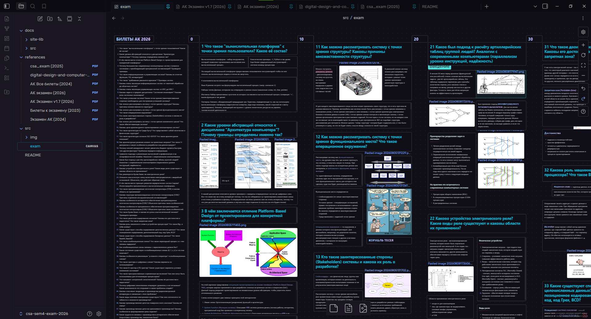

## Билеты курса Архитектура Компьютера (2026) (ИТМО)

Данный репозиторий содержит билеты для подготовки к экзамену по АК на 2026 год. Везде всего понемногу, где мог писали понятно и наглядно

Можете скачать репозиторий и открыть через obsidian или посмотреть его веб-версию [здесь](https://se-itmo-labs.github.io/csa-sem4-exam-2026/src/exam.html)

### Источники

Некоторые источники представлены в разделе references/. Какие-то хорошие, какие-то неоч.

### Билеты подготовили:

- [Снагин Станислав](github.com/ssnagin)
- [Степанов Илья](https://github.com/Step1l)
- [Клевцов Александр](https://github.com/25thGilbertsProblem)